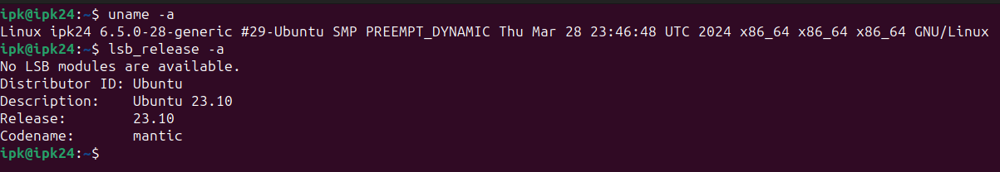
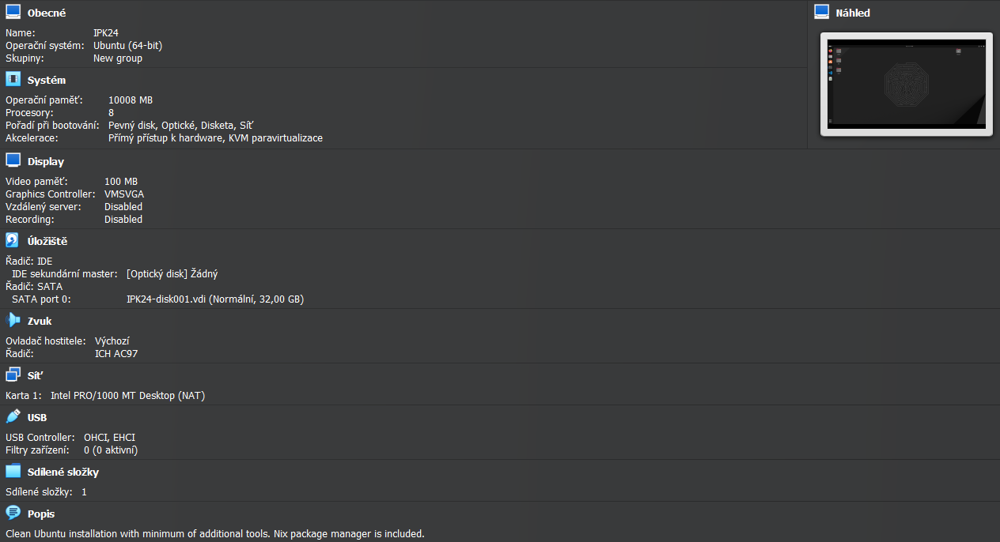
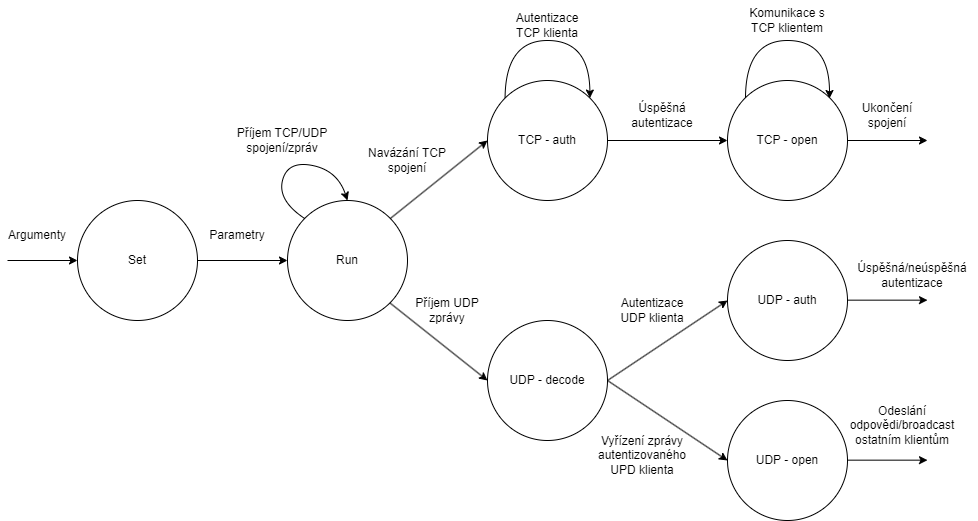
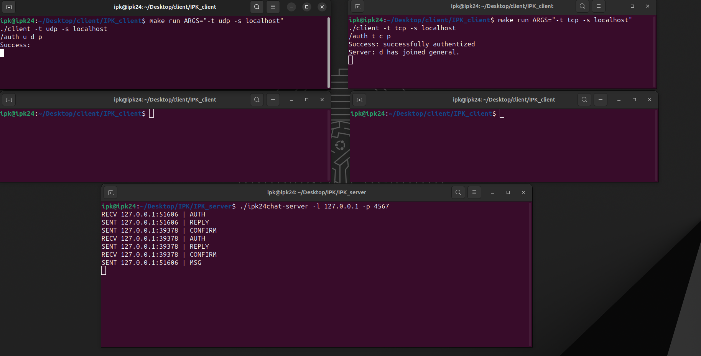
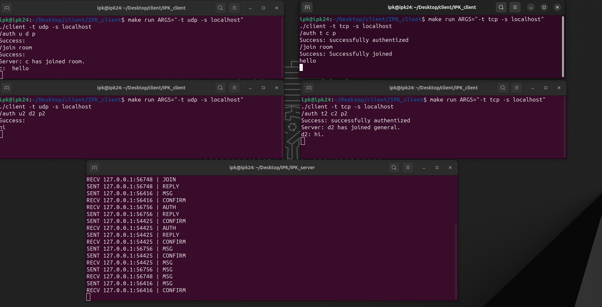
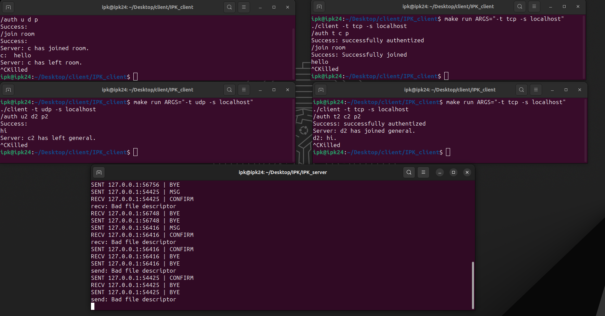

# Chatovací server 
## Shrnutí
Chatovací server pro TCP a UDP klienty, používající IPK24-chat protokol. Server podporuje vytváření samostatných místností pro chat, jejíž zprávy jsou viditelné pouze pro klienty v dané místnosti. Klient se při přístupu na server musí autentizovat uživatelským jménem - maximálně 20 znaků, předpokládá se, že bude unikátní pro každého klienta, jménem pro zobrazení - maximálně 20 znaků dlouhý pseudonym, pod kterým klient vystupuje v chatu a secret - maximálně 128 znaků dlouhé heslo, které je ale u tohoto řešení serveru zanedbáno a nepoužíváno. 
## Vývoj
- Program byl vyvíjen na referenčním virtuálním počítači  IPK24. 
 
 
- Program je napsán v jazyce C a přeložen pomocí přiloženého makefile.
- Pro verzování vývoje programu byl použit repozitář na Gitea.
## Implementace

 
- ### Set
  - Modul `ipk24chat-server.c`  zpracuje argumenty programu, případně vypíše nápovědu na standartní výstup a přejde do dalšího stavu.
- ### Run
  - Modul `server-run.c` a `server-run.h` definují sdílené proměnné, semafory a mutexy pro řízení programu, funkci `handle_ctrl_c` pro ukončení programu, nastavuje parametry spojení pro TCP a UDP. Nakonec se rozdělí na 2 procesy, z nichž jeden obsluhuje příchozí TCP spojení a druhý příchozí UDP zprávy. Tyto procesy následně vytváří nové procesy, které obsluhují jednotlivé spojení nebo zprávy.
- ### TCP
  - #### TCP - auth
    - Modul `tcp-auth.c` a `tcp-auth.h` přijímají pouze autentizační zprávy od klienta. Nějak se nekontroluje unikátnost přihlašovacíh údajů - předpokládá se unikátní uživatelské jméno. Při úspěšné autentizaci se proces přesune do dalšího stavu - tcp - open.
  - #### TCP - open
    - Modul `tcp-open.c` a `tcp-open.h` přijímají zprávy od autentizovaného TCP klienta. Na zprávy příslušně reagují - například join zpráva a reply ok zpráva. V případě zprávy určené pro ostatní účastníky komunikace na serveru tento modul posílá broadcast všem účastníkuům v dané komunikační místnosti. Pro příjem broadcastu je vytvořeno paralelní vlákno, které zasílá klientovi zprávy od ostatních.
- ### UDP
  - #### UDP - decode
    - Modul `udp-decode.c` a `udp-decode.h` dekódují příchozí zprávu od klienta a podle toho adekvátně reagují - popsáno dále v příslušných stavech. Tyto moduly také zajišťují odesílání broadcastových zpráv účastníkům komunikace, k tomu se používá seznam autentizovaných UDP klientů na serveru. 
   - #### UDP - auth
     - Autentizace UDP klienta probíhá stejně jako u TCP, akorát při úspěšné autentizaci je UDP klient přidán na seznam autentizovaných klientů. Funkce pro práci s tímto seznamem jsou implementovány v modulech `udp-clients.c` a `udp-clients.h`, které obsahují funkce na přidání, odebrání, modifikaci a získání informací o klientovi.
    - #### UDP - open
      - Poslanou zprávu je možné broadcastovat a klient se může účastnit komunikace. 
## Spuštení
### Argumenty
- `-[-l <server_address>]`&nbsp;&nbsp;&nbsp;&nbsp;&nbsp;&nbsp;&nbsp;&nbsp;: adresa serveru(implicitně "0.0.0.0"). 
- `[-p <server_port>]`&nbsp;&nbsp;&nbsp;&nbsp;&nbsp;&nbsp;&nbsp;&nbsp;&nbsp;&nbsp;&nbsp;&nbsp;&nbsp;&nbsp;&nbsp;&nbsp;&nbsp;&nbsp;&nbsp;: číslo portu (implicitně 4567).
- `[-d <timeout>]`&nbsp;&nbsp;&nbsp;&nbsp;&nbsp;&nbsp;&nbsp;&nbsp;&nbsp;&nbsp;&nbsp;&nbsp;&nbsp;&nbsp;&nbsp;&nbsp;&nbsp;&nbsp;&nbsp;&nbsp;&nbsp;&nbsp;&nbsp;&nbsp;&nbsp;&nbsp;&nbsp;&nbsp;&nbsp;: pro udp, doba čekání na confirm zprávu od klienta  &nbsp;&nbsp;&nbsp;&nbsp;&nbsp;&nbsp;&nbsp;&nbsp;&nbsp;&nbsp;&nbsp;&nbsp;&nbsp;&nbsp;&nbsp;&nbsp;&nbsp;&nbsp;&nbsp;&nbsp;&nbsp;&nbsp;&nbsp;&nbsp;&nbsp;&nbsp;&nbsp;&nbsp;&nbsp;&nbsp;&nbsp;&nbsp;&nbsp;&nbsp;&nbsp;&nbsp;&nbsp;&nbsp;&nbsp;&nbsp;&nbsp;&nbsp;&nbsp;&nbsp;&nbsp;&nbsp;&nbsp;&nbsp;&nbsp;&nbsp;&nbsp;&nbsp;&nbsp;&nbsp;&nbsp;&nbsp;&nbsp;&nbsp;&nbsp;&nbsp;&nbsp;&nbsp;&nbsp;&nbsp;&nbsp;&nbsp;&nbsp;&nbsp;&nbsp;&nbsp;(implicitně 250ms).
- `[-r <retransmissions>]`&nbsp;&nbsp;&nbsp;&nbsp;&nbsp;&nbsp;&nbsp;&nbsp;: pro udp, počet opětovných zaslání zprávy, na kterou se  &nbsp;&nbsp;&nbsp;&nbsp;&nbsp;&nbsp;&nbsp;&nbsp;&nbsp;&nbsp;&nbsp;&nbsp;&nbsp;&nbsp;&nbsp;&nbsp;&nbsp;&nbsp;&nbsp;&nbsp;&nbsp;&nbsp;&nbsp;&nbsp;&nbsp;&nbsp;&nbsp;&nbsp;&nbsp;&nbsp;&nbsp;&nbsp;&nbsp;&nbsp;&nbsp;&nbsp;&nbsp;&nbsp;&nbsp;&nbsp;&nbsp;&nbsp;&nbsp;&nbsp;&nbsp;&nbsp;&nbsp;&nbsp;&nbsp;&nbsp;&nbsp;&nbsp;&nbsp;&nbsp;&nbsp;&nbsp;&nbsp;&nbsp;&nbsp;&nbsp;&nbsp;&nbsp;&nbsp;&nbsp;&nbsp;&nbsp;&nbsp;&nbsp;&nbsp;&nbsp;očekává zpráva confirm (implicitně 3).  
- `[-h]`&nbsp;&nbsp;&nbsp;&nbsp;&nbsp;&nbsp;&nbsp;&nbsp;&nbsp;&nbsp;&nbsp;&nbsp;&nbsp;&nbsp;&nbsp;&nbsp;&nbsp;&nbsp;&nbsp;&nbsp;&nbsp;&nbsp;&nbsp;&nbsp;&nbsp;&nbsp;&nbsp;&nbsp;&nbsp;&nbsp;&nbsp;&nbsp;&nbsp;&nbsp;&nbsp;&nbsp;&nbsp;&nbsp;&nbsp;&nbsp;&nbsp;&nbsp;&nbsp;&nbsp;&nbsp;&nbsp;&nbsp;&nbsp;&nbsp;&nbsp;&nbsp;&nbsp;&nbsp;&nbsp;&nbsp;: vypíše nápovědu v podobě přehledu argumentů.
### Spuštění
- Kompilace proběhne příkazem: `make` 
- Program lze spustit pomocí přiloženého make souboru pomocí příkazu:
  `make run ARGS="<arguments>"`
- Jinak lze spustit pomocí `./ipk24chat-server <arguments>`

##### Příklady spuštění

- `./ipk24chat-server -l 127.0.0.1 -p 4567`
- `./ipk24chat-server`
- `./ipk24chat-server -l 127.0.0.1 -p 4567 -d 250 -r 3`
- `./ipk24chat-server -h`
## Testování
- Proběhlo ve stejném prostředí jako vývoj - referenční virtuální počítač IPK24.
- Test připojení - jednoduchý test připojení UDP a TCP klienta:
 
- Test připojení do místnosti - UDP a TCP klient se připojí do místnosti a další UDP a TCP klient zůstanou v první místnosti - general. Zprávy se zobrazují pouze v rámci místností:
 
- Test odpojení - Klienti se odpojí ze serveru a z daných místností - informace o odpojení se zobrazuje pouze v rámci místnosti:
 
- Test rozdělené TCP zprávy od klienta - konec zprávy je indikován `'\r\n'`.
 
## Reference
- Dolejška, D. Client for a chat server using IPK24-CHAT protocol [online]. February 2024. [cited 2024-02-14]. Available at: [https://git.fit.vutbr.cz/NESFIT/IPK-Projects-2024/src/branch/master/Project%201](https://git.fit.vutbr.cz/NESFIT/IPK-Projects-2024/src/branch/master/Project%201)
- Stackoverflow. How to check if a Regex expression matches an entire string in c#? [online]. Available at: [https://stackoverflow.com/questions/2036168/how-to-check-if-a-regex-expression-matches-an-entire-string-in-c](https://stackoverflow.com/questions/2036168/how-to-check-if-a-regex-expression-matches-an-entire-string-in-c)
- GeeksforGeeks. TCP Server-Client implementation in C. [online]. Available at: [https://www.geeksforgeeks.org/tcp-server-client-implementation-in-c/](https://www.geeksforgeeks.org/tcp-server-client-implementation-in-c/)
